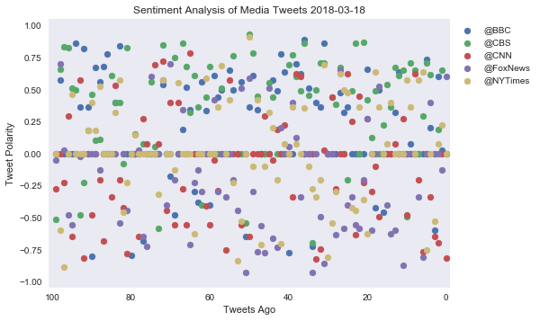

### News Mood Sentiment Analysis

#### 3 Key Points:
1. Depending on the news at the time of the data being collected, it is difficult to have a consistent analysis. The data collected from Tweets, fluctuates often.
2. Fox News seems to have the most negative tweets in the couple times I've run this report.
3. News outlets are biased in what is tweeted out and depending on which political angle is projected, the data of what is defined as negative and positive seems a bit skewed.

#### Project Set-Up


```python
# dependencies
import tweepy
import json
import pandas as pd
import numpy as np
import matplotlib.pyplot as plt
from matplotlib import style
import seaborn as sns

# datetime and time
import time
from datetime import datetime

# import vader sentiment analysis
from vaderSentiment.vaderSentiment import SentimentIntensityAnalyzer
analyzer = SentimentIntensityAnalyzer()

# twitter API keys
from config import (consumer_key, 
                    consumer_secret, 
                    access_token, 
                    access_token_secret)
```

#### Fetch Data


```python
# tweepy API authentication
auth = tweepy.OAuthHandler(consumer_key, consumer_secret)
auth.set_access_token(access_token, access_token_secret)
api = tweepy.API(auth, parser=tweepy.parsers.JSONParser())
```


```python
# create sentiments list
sentiments = []

# target twitter users: BBC, CBS, CNN, Fox, NYT
target_users = ("@BBC", "@CBS", "@CNN", "@FoxNews", "@NYTimes")

# put for loop
for user in target_users:

    counter = 0

    public_tweets = api.user_timeline(user, count=100)

    # loop through all tweets
    for tweet in public_tweets:

        # run Vader analysis on each tweet
        compound = analyzer.polarity_scores(tweet["text"])["compound"]
        pos = analyzer.polarity_scores(tweet["text"])["pos"]
        neu = analyzer.polarity_scores(tweet["text"])["neu"]
        neg = analyzer.polarity_scores(tweet["text"])["neg"]
        tweets_ago = counter
        tweet_text = tweet["text"]

        # add sentiments for each tweet to the sentiments list
        sentiments.append({"User" : user,
                           "Date": tweet["created_at"],
                           "Compound" : compound,
                           "Positive" : pos,
                           "Negative" : neg,
                           "Neutral" : neu,
                           "Tweets Ago" : counter,
                           "Tweet Text" : tweet_text})

        # add counter
        counter = counter + 1
```


```python
# pandas dataframe
newsmoods = pd.DataFrame.from_dict(sentiments)
newsmoods
```


<div>
<style>
    .dataframe thead tr:only-child th {
        text-align: right;
    }

    .dataframe thead th {
        text-align: left;
    }

    .dataframe tbody tr th {
        vertical-align: top;
    }
</style>
<table border="1" class="dataframe">
  <thead>
    <tr style="text-align: right;">
      <th></th>
      <th>Compound</th>
      <th>Date</th>
      <th>Negative</th>
      <th>Neutral</th>
      <th>Positive</th>
      <th>Tweet Text</th>
      <th>Tweets Ago</th>
      <th>User</th>
    </tr>
  </thead>
  <tbody>
    <tr>
      <th>0</th>
      <td>0.0000</td>
      <td>Sun Mar 18 20:30:11 +0000 2018</td>
      <td>0.000</td>
      <td>1.000</td>
      <td>0.000</td>
      <td>🏃💪 @LesDennis, @SimplySusannah, @Tameka_Empson...</td>
      <td>0</td>
      <td>@BBC</td>
    </tr>
    <tr>
      <th>1</th>
      <td>0.0258</td>
      <td>Sun Mar 18 20:03:04 +0000 2018</td>
      <td>0.086</td>
      <td>0.824</td>
      <td>0.090</td>
      <td>👎💌 Fans of K-Pop boyband member @IBGDRGN have ...</td>
      <td>1</td>
      <td>@BBC</td>
    </tr>
    <tr>
      <th>2</th>
      <td>0.5994</td>
      <td>Sun Mar 18 19:33:04 +0000 2018</td>
      <td>0.000</td>
      <td>0.803</td>
      <td>0.197</td>
      <td>Saoirse Ronan stars as Eilis, a young girl who...</td>
      <td>2</td>
      <td>@BBC</td>
    </tr>
    <tr>
      <th>3</th>
      <td>-0.5994</td>
      <td>Sun Mar 18 18:44:02 +0000 2018</td>
      <td>0.163</td>
      <td>0.837</td>
      <td>0.000</td>
      <td>Ruth Ellis was only 28 when she became the las...</td>
      <td>3</td>
      <td>@BBC</td>
    </tr>
    <tr>
      <th>4</th>
      <td>0.2040</td>
      <td>Sun Mar 18 18:34:14 +0000 2018</td>
      <td>0.077</td>
      <td>0.772</td>
      <td>0.151</td>
      <td>RT @BBC_TopGear: 840bhp goes a little like thi...</td>
      <td>4</td>
      <td>@BBC</td>
    </tr>
    <tr>
      <th>5</th>
      <td>0.7331</td>
      <td>Sun Mar 18 17:18:12 +0000 2018</td>
      <td>0.000</td>
      <td>0.660</td>
      <td>0.340</td>
      <td>RT @bbcthree: Be honest, do you think you'll b...</td>
      <td>5</td>
      <td>@BBC</td>
    </tr>
    <tr>
      <th>6</th>
      <td>0.0000</td>
      <td>Sun Mar 18 17:04:03 +0000 2018</td>
      <td>0.000</td>
      <td>1.000</td>
      <td>0.000</td>
      <td>🍎🗑 How much food do you throw away? If you're ...</td>
      <td>6</td>
      <td>@BBC</td>
    </tr>
    <tr>
      <th>7</th>
      <td>0.0000</td>
      <td>Sun Mar 18 16:33:17 +0000 2018</td>
      <td>0.000</td>
      <td>1.000</td>
      <td>0.000</td>
      <td>❤️️📸Zun Lee wants his photography to give a ba...</td>
      <td>7</td>
      <td>@BBC</td>
    </tr>
    <tr>
      <th>8</th>
      <td>0.0000</td>
      <td>Sun Mar 18 15:41:04 +0000 2018</td>
      <td>0.000</td>
      <td>1.000</td>
      <td>0.000</td>
      <td>🤰 A doctor explains why you can get pregnant a...</td>
      <td>8</td>
      <td>@BBC</td>
    </tr>
    <tr>
      <th>9</th>
      <td>0.0772</td>
      <td>Sun Mar 18 14:33:07 +0000 2018</td>
      <td>0.000</td>
      <td>0.947</td>
      <td>0.053</td>
      <td>RT @BBCEngland: A number of runners have held ...</td>
      <td>9</td>
      <td>@BBC</td>
    </tr>
    <tr>
      <th>10</th>
      <td>0.0000</td>
      <td>Sun Mar 18 14:28:23 +0000 2018</td>
      <td>0.000</td>
      <td>1.000</td>
      <td>0.000</td>
      <td>RT @BBCSport: They’ve done it! Gold for GB’s M...</td>
      <td>10</td>
      <td>@BBC</td>
    </tr>
    <tr>
      <th>11</th>
      <td>0.0000</td>
      <td>Sun Mar 18 14:18:01 +0000 2018</td>
      <td>0.000</td>
      <td>1.000</td>
      <td>0.000</td>
      <td>📱🚗 Why a rise in electric cars could also mean...</td>
      <td>11</td>
      <td>@BBC</td>
    </tr>
    <tr>
      <th>12</th>
      <td>0.6369</td>
      <td>Sun Mar 18 14:08:37 +0000 2018</td>
      <td>0.000</td>
      <td>0.682</td>
      <td>0.318</td>
      <td>RT @BBC6Music: ✏️ Which song has the greatest ...</td>
      <td>12</td>
      <td>@BBC</td>
    </tr>
    <tr>
      <th>13</th>
      <td>0.3182</td>
      <td>Sun Mar 18 13:45:03 +0000 2018</td>
      <td>0.000</td>
      <td>0.905</td>
      <td>0.095</td>
      <td>🎤Pop music is awash with those that released o...</td>
      <td>13</td>
      <td>@BBC</td>
    </tr>
    <tr>
      <th>14</th>
      <td>0.0000</td>
      <td>Sun Mar 18 13:00:08 +0000 2018</td>
      <td>0.000</td>
      <td>1.000</td>
      <td>0.000</td>
      <td>🍔😲 Would you eat a burger pie?  \n#BackInTimeF...</td>
      <td>14</td>
      <td>@BBC</td>
    </tr>
    <tr>
      <th>15</th>
      <td>0.0000</td>
      <td>Sun Mar 18 12:29:50 +0000 2018</td>
      <td>0.000</td>
      <td>1.000</td>
      <td>0.000</td>
      <td>RT @BBCOne: If food is the language of love......</td>
      <td>15</td>
      <td>@BBC</td>
    </tr>
    <tr>
      <th>16</th>
      <td>-0.4588</td>
      <td>Sun Mar 18 11:43:04 +0000 2018</td>
      <td>0.167</td>
      <td>0.833</td>
      <td>0.000</td>
      <td>Ever wondered why David Bowie wore an eye patc...</td>
      <td>16</td>
      <td>@BBC</td>
    </tr>
    <tr>
      <th>17</th>
      <td>0.4939</td>
      <td>Sun Mar 18 10:30:04 +0000 2018</td>
      <td>0.000</td>
      <td>0.826</td>
      <td>0.174</td>
      <td>🍞🥖 Want to learn how to bake bread?\n\nThese e...</td>
      <td>17</td>
      <td>@BBC</td>
    </tr>
    <tr>
      <th>18</th>
      <td>-0.4215</td>
      <td>Sun Mar 18 10:00:08 +0000 2018</td>
      <td>0.259</td>
      <td>0.741</td>
      <td>0.000</td>
      <td>“I regret spending £50,000 on my wedding.” htt...</td>
      <td>18</td>
      <td>@BBC</td>
    </tr>
    <tr>
      <th>19</th>
      <td>0.0000</td>
      <td>Sun Mar 18 09:30:03 +0000 2018</td>
      <td>0.000</td>
      <td>1.000</td>
      <td>0.000</td>
      <td>How to be 20 on the inside, even when you’re 8...</td>
      <td>19</td>
      <td>@BBC</td>
    </tr>
    <tr>
      <th>20</th>
      <td>0.6560</td>
      <td>Sun Mar 18 09:19:33 +0000 2018</td>
      <td>0.061</td>
      <td>0.727</td>
      <td>0.212</td>
      <td>RT @BBCNews: Snow and ice are bringing disrupt...</td>
      <td>20</td>
      <td>@BBC</td>
    </tr>
    <tr>
      <th>21</th>
      <td>0.0000</td>
      <td>Sun Mar 18 09:10:02 +0000 2018</td>
      <td>0.000</td>
      <td>1.000</td>
      <td>0.000</td>
      <td>RT @bbc5live: The beast from the east is back ...</td>
      <td>21</td>
      <td>@BBC</td>
    </tr>
    <tr>
      <th>22</th>
      <td>0.0000</td>
      <td>Sat Mar 17 20:02:01 +0000 2018</td>
      <td>0.000</td>
      <td>1.000</td>
      <td>0.000</td>
      <td>These seven celebrities are about to go on the...</td>
      <td>22</td>
      <td>@BBC</td>
    </tr>
    <tr>
      <th>23</th>
      <td>0.0000</td>
      <td>Sat Mar 17 19:21:02 +0000 2018</td>
      <td>0.000</td>
      <td>1.000</td>
      <td>0.000</td>
      <td>Can we just take a moment to discuss Eddie Red...</td>
      <td>23</td>
      <td>@BBC</td>
    </tr>
    <tr>
      <th>24</th>
      <td>0.0000</td>
      <td>Sat Mar 17 18:32:01 +0000 2018</td>
      <td>0.000</td>
      <td>1.000</td>
      <td>0.000</td>
      <td>Ouch! 😂🔥@GordonRamsay's daughter is hilarious....</td>
      <td>24</td>
      <td>@BBC</td>
    </tr>
    <tr>
      <th>25</th>
      <td>0.3612</td>
      <td>Sat Mar 17 18:03:04 +0000 2018</td>
      <td>0.000</td>
      <td>0.857</td>
      <td>0.143</td>
      <td>🐜1⃣2⃣3⃣Sir David Attenborough explores whether...</td>
      <td>25</td>
      <td>@BBC</td>
    </tr>
    <tr>
      <th>26</th>
      <td>0.3182</td>
      <td>Sat Mar 17 17:30:07 +0000 2018</td>
      <td>0.000</td>
      <td>0.901</td>
      <td>0.099</td>
      <td>One of the writers for The Simpsons has told @...</td>
      <td>26</td>
      <td>@BBC</td>
    </tr>
    <tr>
      <th>27</th>
      <td>0.4767</td>
      <td>Sat Mar 17 17:00:08 +0000 2018</td>
      <td>0.000</td>
      <td>0.785</td>
      <td>0.215</td>
      <td>🎓📚 'The moment I gave Reese Witherspoon my Leg...</td>
      <td>27</td>
      <td>@BBC</td>
    </tr>
    <tr>
      <th>28</th>
      <td>0.0000</td>
      <td>Sat Mar 17 16:39:39 +0000 2018</td>
      <td>0.000</td>
      <td>1.000</td>
      <td>0.000</td>
      <td>RT @BBCWorld: Blossom in south-west China capt...</td>
      <td>28</td>
      <td>@BBC</td>
    </tr>
    <tr>
      <th>29</th>
      <td>0.0000</td>
      <td>Sat Mar 17 15:03:12 +0000 2018</td>
      <td>0.000</td>
      <td>1.000</td>
      <td>0.000</td>
      <td>This year, over 250 landmarks across the globe...</td>
      <td>29</td>
      <td>@BBC</td>
    </tr>
    <tr>
      <th>...</th>
      <td>...</td>
      <td>...</td>
      <td>...</td>
      <td>...</td>
      <td>...</td>
      <td>...</td>
      <td>...</td>
      <td>...</td>
    </tr>
    <tr>
      <th>470</th>
      <td>0.0000</td>
      <td>Sun Mar 18 12:45:03 +0000 2018</td>
      <td>0.000</td>
      <td>1.000</td>
      <td>0.000</td>
      <td>2 California cities, 2 very different approach...</td>
      <td>70</td>
      <td>@NYTimes</td>
    </tr>
    <tr>
      <th>471</th>
      <td>0.0000</td>
      <td>Sun Mar 18 12:36:27 +0000 2018</td>
      <td>0.000</td>
      <td>1.000</td>
      <td>0.000</td>
      <td>Britain Says It Has Proof Russia Stockpiled Le...</td>
      <td>71</td>
      <td>@NYTimes</td>
    </tr>
    <tr>
      <th>472</th>
      <td>0.5719</td>
      <td>Sun Mar 18 12:15:06 +0000 2018</td>
      <td>0.000</td>
      <td>0.821</td>
      <td>0.179</td>
      <td>An Indian children’s book spotlights 11 leader...</td>
      <td>72</td>
      <td>@NYTimes</td>
    </tr>
    <tr>
      <th>473</th>
      <td>-0.3182</td>
      <td>Sun Mar 18 12:10:07 +0000 2018</td>
      <td>0.223</td>
      <td>0.777</td>
      <td>0.000</td>
      <td>Loose Ends: Daily Affirmations From the White ...</td>
      <td>73</td>
      <td>@NYTimes</td>
    </tr>
    <tr>
      <th>474</th>
      <td>0.0000</td>
      <td>Sun Mar 18 11:45:42 +0000 2018</td>
      <td>0.000</td>
      <td>1.000</td>
      <td>0.000</td>
      <td>Review: As James Levine Sues, the Met Opera Op...</td>
      <td>74</td>
      <td>@NYTimes</td>
    </tr>
    <tr>
      <th>475</th>
      <td>0.0000</td>
      <td>Sun Mar 18 11:45:06 +0000 2018</td>
      <td>0.000</td>
      <td>1.000</td>
      <td>0.000</td>
      <td>How to spend 36 hours in Oaxaca, Mexico https:...</td>
      <td>75</td>
      <td>@NYTimes</td>
    </tr>
    <tr>
      <th>476</th>
      <td>0.0000</td>
      <td>Sun Mar 18 11:15:06 +0000 2018</td>
      <td>0.000</td>
      <td>1.000</td>
      <td>0.000</td>
      <td>Chocolate oatmeal for breakfast, anyone?\n htt...</td>
      <td>76</td>
      <td>@NYTimes</td>
    </tr>
    <tr>
      <th>477</th>
      <td>0.0000</td>
      <td>Sun Mar 18 10:45:02 +0000 2018</td>
      <td>0.000</td>
      <td>1.000</td>
      <td>0.000</td>
      <td>You asked: Can I catch the same cold twice? He...</td>
      <td>77</td>
      <td>@NYTimes</td>
    </tr>
    <tr>
      <th>478</th>
      <td>0.0000</td>
      <td>Sun Mar 18 10:15:02 +0000 2018</td>
      <td>0.000</td>
      <td>1.000</td>
      <td>0.000</td>
      <td>One of the fastest American marathon runners r...</td>
      <td>78</td>
      <td>@NYTimes</td>
    </tr>
    <tr>
      <th>479</th>
      <td>0.1440</td>
      <td>Sun Mar 18 09:54:37 +0000 2018</td>
      <td>0.000</td>
      <td>0.876</td>
      <td>0.124</td>
      <td>Nancy Pelosi Wants to Lead. More Democratic Ca...</td>
      <td>79</td>
      <td>@NYTimes</td>
    </tr>
    <tr>
      <th>480</th>
      <td>0.0000</td>
      <td>Sun Mar 18 09:46:57 +0000 2018</td>
      <td>0.000</td>
      <td>1.000</td>
      <td>0.000</td>
      <td>Sunday Routine: How Tamara Shopsin, Illustrato...</td>
      <td>80</td>
      <td>@NYTimes</td>
    </tr>
    <tr>
      <th>481</th>
      <td>-0.2263</td>
      <td>Sun Mar 18 09:43:05 +0000 2018</td>
      <td>0.192</td>
      <td>0.808</td>
      <td>0.000</td>
      <td>James Levine, a Fractured Partnership and a Me...</td>
      <td>81</td>
      <td>@NYTimes</td>
    </tr>
    <tr>
      <th>482</th>
      <td>-0.4588</td>
      <td>Sun Mar 18 09:31:25 +0000 2018</td>
      <td>0.167</td>
      <td>0.833</td>
      <td>0.000</td>
      <td>French bulldogs are far more fragile than they...</td>
      <td>82</td>
      <td>@NYTimes</td>
    </tr>
    <tr>
      <th>483</th>
      <td>0.5719</td>
      <td>Sun Mar 18 09:13:08 +0000 2018</td>
      <td>0.000</td>
      <td>0.684</td>
      <td>0.316</td>
      <td>Trilobites: In Search of the Perfect Hair Dye ...</td>
      <td>83</td>
      <td>@NYTimes</td>
    </tr>
    <tr>
      <th>484</th>
      <td>0.3182</td>
      <td>Sun Mar 18 08:57:53 +0000 2018</td>
      <td>0.000</td>
      <td>0.813</td>
      <td>0.187</td>
      <td>Presidential Vote in Russia Sure to Give Putin...</td>
      <td>84</td>
      <td>@NYTimes</td>
    </tr>
    <tr>
      <th>485</th>
      <td>0.0000</td>
      <td>Sun Mar 18 08:42:26 +0000 2018</td>
      <td>0.000</td>
      <td>1.000</td>
      <td>0.000</td>
      <td>The evolution of Alan Hollinghurst, one of fic...</td>
      <td>85</td>
      <td>@NYTimes</td>
    </tr>
    <tr>
      <th>486</th>
      <td>0.0000</td>
      <td>Sun Mar 18 08:25:46 +0000 2018</td>
      <td>0.000</td>
      <td>1.000</td>
      <td>0.000</td>
      <td>‘S.N.L.’ Takes Aim at Betsy DeVos, Jeff Sessio...</td>
      <td>86</td>
      <td>@NYTimes</td>
    </tr>
    <tr>
      <th>487</th>
      <td>0.0000</td>
      <td>Sun Mar 18 08:16:27 +0000 2018</td>
      <td>0.000</td>
      <td>1.000</td>
      <td>0.000</td>
      <td>"The violinist's daughter gave me a book of po...</td>
      <td>87</td>
      <td>@NYTimes</td>
    </tr>
    <tr>
      <th>488</th>
      <td>0.5267</td>
      <td>Sun Mar 18 07:59:13 +0000 2018</td>
      <td>0.000</td>
      <td>0.805</td>
      <td>0.195</td>
      <td>Jay-Z and Beyoncé's tour announcement took its...</td>
      <td>88</td>
      <td>@NYTimes</td>
    </tr>
    <tr>
      <th>489</th>
      <td>0.1779</td>
      <td>Sun Mar 18 07:42:38 +0000 2018</td>
      <td>0.095</td>
      <td>0.779</td>
      <td>0.126</td>
      <td>For years, no chef dared try to improve the ic...</td>
      <td>89</td>
      <td>@NYTimes</td>
    </tr>
    <tr>
      <th>490</th>
      <td>0.4019</td>
      <td>Sun Mar 18 07:25:28 +0000 2018</td>
      <td>0.000</td>
      <td>0.722</td>
      <td>0.278</td>
      <td>A healthy dinner that packs in flavor https://...</td>
      <td>90</td>
      <td>@NYTimes</td>
    </tr>
    <tr>
      <th>491</th>
      <td>0.1779</td>
      <td>Sun Mar 18 07:08:34 +0000 2018</td>
      <td>0.206</td>
      <td>0.515</td>
      <td>0.278</td>
      <td>Should teenagers protest? Research says yes. h...</td>
      <td>91</td>
      <td>@NYTimes</td>
    </tr>
    <tr>
      <th>492</th>
      <td>0.0000</td>
      <td>Sun Mar 18 06:51:40 +0000 2018</td>
      <td>0.000</td>
      <td>1.000</td>
      <td>0.000</td>
      <td>Wedding season is upon us (it officially kicks...</td>
      <td>92</td>
      <td>@NYTimes</td>
    </tr>
    <tr>
      <th>493</th>
      <td>0.0000</td>
      <td>Sun Mar 18 06:34:57 +0000 2018</td>
      <td>0.000</td>
      <td>1.000</td>
      <td>0.000</td>
      <td>As the list of endangered animals worldwide gr...</td>
      <td>93</td>
      <td>@NYTimes</td>
    </tr>
    <tr>
      <th>494</th>
      <td>0.0000</td>
      <td>Sun Mar 18 06:18:09 +0000 2018</td>
      <td>0.000</td>
      <td>1.000</td>
      <td>0.000</td>
      <td>If cooking is a vehicle for memory, for many F...</td>
      <td>94</td>
      <td>@NYTimes</td>
    </tr>
    <tr>
      <th>495</th>
      <td>0.4588</td>
      <td>Sun Mar 18 06:01:27 +0000 2018</td>
      <td>0.000</td>
      <td>0.810</td>
      <td>0.190</td>
      <td>There's so much to see and do in St. Louis, an...</td>
      <td>95</td>
      <td>@NYTimes</td>
    </tr>
    <tr>
      <th>496</th>
      <td>0.0000</td>
      <td>Sun Mar 18 05:42:48 +0000 2018</td>
      <td>0.000</td>
      <td>1.000</td>
      <td>0.000</td>
      <td>Here's the 2018 election calendar https://t.co...</td>
      <td>96</td>
      <td>@NYTimes</td>
    </tr>
    <tr>
      <th>497</th>
      <td>-0.8834</td>
      <td>Sun Mar 18 05:26:32 +0000 2018</td>
      <td>0.393</td>
      <td>0.511</td>
      <td>0.096</td>
      <td>Many people attribute cancer to bad luck. But ...</td>
      <td>97</td>
      <td>@NYTimes</td>
    </tr>
    <tr>
      <th>498</th>
      <td>-0.5994</td>
      <td>Sun Mar 18 05:09:41 +0000 2018</td>
      <td>0.311</td>
      <td>0.546</td>
      <td>0.143</td>
      <td>Modern Love: He was struggling with an obscure...</td>
      <td>98</td>
      <td>@NYTimes</td>
    </tr>
    <tr>
      <th>499</th>
      <td>0.0000</td>
      <td>Sun Mar 18 04:52:11 +0000 2018</td>
      <td>0.000</td>
      <td>1.000</td>
      <td>0.000</td>
      <td>For the record: I'm With Her chose its band na...</td>
      <td>99</td>
      <td>@NYTimes</td>
    </tr>
  </tbody>
</table>
<p>500 rows × 8 columns</p>
</div>


```python
# create analysis date
analysis_date = datetime.now().date()

# export to csv
newsmoods.to_csv("Twitter_News_Mood.csv", index=False)
```

#### Scatter Plot Magic


```python
# plot scatter plot and x limit
plt.xlim(101, -1)

# use for loop
for user in target_users:
    dataframe = newsmoods.loc[newsmoods["User"] == user]
    plt.scatter(dataframe["Tweets Ago"], dataframe["Compound"], label=user)
    
# legend
plt.legend(bbox_to_anchor = (1,1))

# title, x axis label, y axis label.
plt.title(f"Sentiment Analysis of Media Tweets {analysis_date}")
plt.xlabel("Tweets Ago")
plt.ylabel("Tweet Polarity")

# grid plot
plt.grid()

plt.savefig(f"newsmoods_tweepy_api_plot.png")
plt.show()
```





#### Overall (Average) Sentiment Bar Plot


```python
# get average sentiment using groupby
average_sentiment = newsmoods.groupby("User")["Compound"].mean()
average_sentiment
```


    User
    @BBC        0.180383
    @CBS        0.304366
    @CNN       -0.083784
    @FoxNews   -0.136425
    @NYTimes    0.029086
    Name: Compound, dtype: float64


```python
x_axis = np.arange(len(average_sentiment))
xlabels = average_sentiment.index
count = 0

for sentiment in average_sentiment:
    plt.text(count, sentiment+.01, str(round(sentiment,2)))
    count = count + 1

plt.bar(x_axis, average_sentiment, tick_label = xlabels, color = ['b','g','pink','r','y'])

# title, x axis label, and y axis label
plt.title(f"Overall Sentiment of Media Tweets {analysis_date}")
plt.xlabel("New Organizations")
plt.ylabel("Tweet Polarity")
plt.savefig(f"newsmoods_tweepy_api_bar.png")
plt.show()
```


